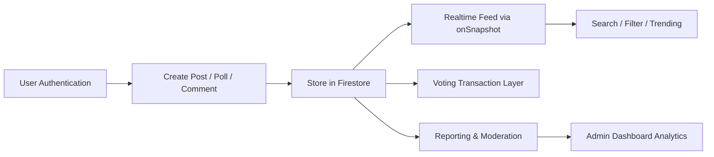

# Campus Whisper Project Report

## 1. Dataset Description

**Source:**  
The project uses a live **Firebase Firestore** database rather than a static packaged dataset. Data is generated by platform users through anonymous or Google-authenticated interactions.

**Primary collections:**
- `posts`
- `comments`
- `postVotes`
- `reports`
- `bannedUsers`

**Dataset size:**  
The dataset size is **dynamic** and depends on the deployed Firestore instance. The repository does not include an exported snapshot, so the number of posts, comments, reports, and bans must be read from the live database at runtime.

**Main features stored in the dataset:**

| Collection | Key Features |
|---|---|
| `posts` | `userId`, `authorIsAnonymous`, `content`, `postType`, `category`, `upvotes`, `downvotes`, `commentCount`, `pollOptions`, `createdAt`, `updatedAt`, `isDeleted` |
| `comments` | `postId`, `parentCommentId`, `userId`, `authorIsAnonymous`, `content`, `upvotes`, `downvotes`, `replyCount`, `createdAt`, `updatedAt` |
| `postVotes` | `postId`, `userId`, `type`, `updatedAt` |
| `reports` | `reportedUserId`, `reportedContentId`, `reportedContentType`, `reporterUserId`, `reason`, `description`, `status`, `adminNotes`, `createdAt`, `resolvedAt` |
| `bannedUsers` | `userId`, `reason`, `bannedBy`, `reportId`, `createdAt` |

**Preprocessing and validation steps:**
- User-generated text is trimmed before submission.
- Post content is capped at **1000 characters**.
- Posts are labeled into fixed categories: `General`, `Academics`, `Social`, `Housing`, `Food`, `Events`, `Help`.
- Poll posts require at least **2** and at most **4** options.
- Poll options are normalized by trimming and checked for uniqueness.
- Deleted posts are excluded from feed and analytics views using `isDeleted`.
- Search is normalized to lowercase and matched against post content and category.
- Duplicate reports on the same content by the same user are blocked.
- Comment deletion is handled as hard deletion for simpler query logic and cleaner counts.

## 2. Problem Statement

Campus communities often need a space to share concerns, questions, and opinions without social pressure. Traditional discussion platforms usually expose identity, provide limited moderation tooling, or make campus-specific engagement difficult.

This project addresses that gap by building an **anonymous campus forum** that supports:
- anonymous participation,
- structured discussion through posts and nested comments,
- community feedback through voting and polls,
- moderation through reporting and banning,
- basic analytics for administrators.

## 3. Methodology

**Approach used:**  
The system is implemented as a **real-time web application** using:
- **Next.js 16** for the frontend,
- **React 19** for interactive UI,
- **Firebase Authentication** for anonymous and Google sign-in,
- **Cloud Firestore** for real-time storage and subscriptions.

**Core method design:**
- Posts and comments are stored as Firestore documents.
- Real-time updates are delivered through `onSnapshot` listeners.
- Voting uses Firestore transactions to safely update counts and prevent inconsistent state.
- Trending logic is computed from engagement signals instead of a trained ML model.
- Moderation is handled through report records, admin review workflows, and a banned-user store.

**Ranking / scoring logic:**
- Latest feed: sorts by `createdAt`.
- Trending feed: combines recency, votes, and discussion activity.
- Admin engagement score:  
  `upvotes + 2 x commentCount - downvotes`

**System workflow:**

## 4. Results and Insights

**Implemented measurable outputs:**  
The admin dashboard computes the following live metrics:
- total posts,
- total comments,
- total reports,
- pending reports,
- total banned users,
- average comments per post,
- top content category,
- engagement score.

**Key findings from the implementation:**
- The project is designed for **real-time observability**, since platform statistics update directly from Firestore snapshots.
- Engagement is measured using both reactions and discussion depth, not just raw post count.
- Moderation is built into the product workflow instead of being treated as an afterthought.
- Query complexity was intentionally reduced by simplifying Firestore reads and removing expensive patterns that required extra composite indexes.

**Observed engineering outcomes from the codebase:**
- Voting consistency is improved through transaction-based updates.
- Comment loading is more reliable after simplifying query logic.
- Search works without an external search engine by using client-side filtering on fetched posts.
- The app supports both low-friction anonymous access and optional authenticated access.

**Charts applicable for evaluation:**  
These can be generated directly from live admin data:
- Bar chart of posts by category
- Line chart of posts/comments over time
- Pie chart of report status distribution
- KPI cards for engagement, pending reports, and average comments per post

Because no Firestore export is bundled in the repository, **numeric chart values are not available offline in this codebase alone**.

## 5. Novelty

The project’s main novelty is not a new ML algorithm, but the **combination of anonymity, community engagement, and moderation analytics in one lightweight campus-focused platform**.

**What is innovative here:**
- Dual-mode participation: users can join anonymously or with Google sign-in.
- Anonymous social posting with structured categories and poll support.
- Built-in moderation pipeline with reporting, admin review, and banning.
- Real-time analytics generated directly from operational data.
- A practical ranking strategy that blends recency and engagement without requiring a separate recommendation model.

## 6. Conclusion

Campus Whisper is a practical full-stack anonymous discussion system built around real-time community interaction and safety controls. Its strength lies in integrating content creation, engagement, moderation, and analytics into a single Firestore-backed application. If a live dataset snapshot is exported, this report can be extended with exact counts, charts, and time-based performance trends.
